<div align="center">


<br/>

[](https://linkedin.com/in/valodya-gevorgyan-783531274)
[](https://github.com/11vg11)
[](mailto:gevorgyanvalodya0@gmail.com)


</div>

<br/>

<div align="center">


```text
01010011 01000101 01000011 01010101 01010010 01001001 01010100 01011001
```

### `SECURITY IS NOT A PRODUCT. IT IS A PROCESS.`

</div>

---

## `> ./whoami`

```text
╔════════════════════════════════════════════════════════════════════╗
║                                                                    ║
║  IDENTITY       Valodya Gevorgyan                                  ║
║  LOCATION       Yerevan, Armenia                                   ║
║  FIELD          Cybersecurity · DevOps · Software Engineering      ║
║  EDUCATION      Applied Computer Science & AI                      ║
║                 Sapienza University of Rome — Erasmus              ║
║  TRAINING       Picsart Academy — Cybersecurity Track              ║
║  FOCUS          Secure Infrastructure · Linux · Automation          ║
║  LANGUAGES      C · Python · JavaScript · Bash                     ║
║                                                                    ║
║  STATUS         [ ACTIVE ]                                         ║
║  OBJECTIVE      Build resilient systems. Strengthen security.      ║
║                 Deliver reliable engineering solutions.            ║
║                                                                    ║
╚════════════════════════════════════════════════════════════════════╝
```

I am a cybersecurity-focused engineer with a strong interest in DevOps practices, secure infrastructure, and dependable software delivery. My work sits at the intersection of security, systems, and automation, where I focus on building resilient environments and improving operational maturity.

My professional interests include ethical hacking, network security, Linux administration, infrastructure hardening, secure software development, and practical automation.

```bash
$ cat mindset.txt

Understand systems deeply.
Protect them deliberately.
Build them responsibly.
```

> All security research and testing represented on this profile is conducted in authorized, educational, and ethical environments.

---

## `> cat current_mission.log`

```yaml
currently_learning:
  - network security
  - ethical hacking methodologies
  - Linux internals
  - secure software development
  - DevOps automation practices
  - cloud and infrastructure security

currently_building:
  - cybersecurity tools
  - secure automation workflows
  - systems engineering projects
  - resilient infrastructure solutions

long_term_objective:
  - grow into a high-impact cybersecurity and DevOps professional
  - contribute to safer, more reliable systems
  - solve complex technical problems with discipline and precision
```

---

## `> load --module tech_arsenal`

<div align="center">

### Core Specializations


### Programming


### Systems and Security


### Areas of Interest


</div>

---

## `> scan --target skill_matrix`

```text
SECURITY OPERATIONS      ██████████████░░░░░░  ADVANCING
DEVOPS PRACTICES         █████████████░░░░░░░  GROWING
LINUX SYSTEMS            ███████████████░░░░░  ACTIVE
PYTHON                   ██████████████░░░░░░  ACTIVE
C                        █████████████░░░░░░░  ACTIVE
JAVASCRIPT               ████████████░░░░░░░░  ACTIVE
WEB SECURITY             ███████████░░░░░░░░░  EXPANDING
```

---

## `> ls ./featured_operations`

<div align="center">

| Operation | Mission Brief | Technology |
|:---|:---|:---:|
| **[PROJECT_01](https://github.com/11vg11)** | Add a description of your strongest cybersecurity or networking project. | `C` `NETWORKING` |
| **[PROJECT_02](https://github.com/11vg11)** | Add a Python security tool, automation script, or vulnerability-analysis project. | `PYTHON` `SECURITY` |
| **[PROJECT_03](https://github.com/11vg11)** | Add a web, backend, or secure-development project. | `JAVASCRIPT` `WEB` |

</div>

---

## `> pull github_telemetry`

<div align="center">



<br/><br/>


<br/><br/>


<br/>


<br/>


</div>

---

## `> establish_secure_connection`

<div align="center">

```text
AVAILABLE CHANNELS
────────────────────────────────────────
LINKEDIN    Professional network
GITHUB      Projects and source code
EMAIL       Direct communication
────────────────────────────────────────
```

[](https://linkedin.com/in/valodya-gevorgyan-783531274)
[](https://github.com/11vg11)
[](mailto:gevorgyanvalodya0@gmail.com)

<br/>

```console
root@gevorgyan:~$ session --status

[+] Identity verified
[+] Secure connection established
[+] Continuous learning enabled
[+] New challenges accepted

root@gevorgyan:~$ exit
Connection closed.
```

### `"The quieter you become, the more you are able to hear."`

</div>


